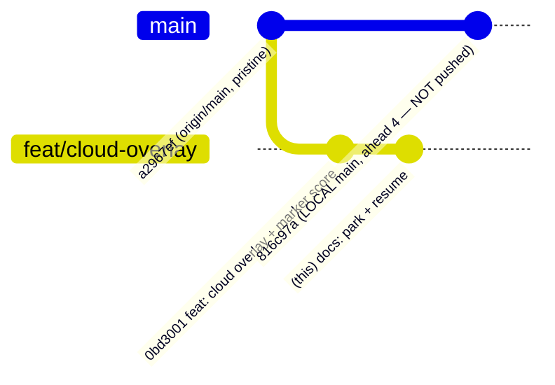

# Cloud Coverage Overlay — PARKED (resume doc)

> **Status: 🅿️ PARKED / ⛔ blocked on an external dependency (OpenWeatherMap account activation).**
> The code is **complete and gated-green**; it does not render live tiles only because the
> OWM API key is not yet activated (OWM returns 401 on *all* endpoints, including the free
> `2.5/weather` call — an account-level activation delay, not a code bug).
>
> Parked 2026-07-14. Resume by following the checklist at the bottom.

---

## Branch / version-control state



| Fact | Value |
|------|-------|
| Branch | `feat/cloud-overlay` |
| Feature commit | `0bd3001` — *feat(map): sunset-timed cloud coverage overlay + cloud-quality score on markers* |
| Base (pristine) | `a2967ef` = `origin/main` |
| Merged to `main`? | **No** — deliberately parked. (Local `main` @ `816c97a` still contains an earlier throwaway merge of both features and is unpushed / ahead of `origin/main` by 4. Treat `origin/main` as truth.) |
| Sibling feature | `feat/belt-of-venus` @ `ad6d7c4` (being UAT'd in isolation) |
| Pushed? | No. Local only. |

## What this feature adds (5 files, +180 lines vs base)

| File | Purpose |
|------|---------|
| `src/app/api/tiles/clouds/[z]/[x]/[y]/route.ts` | **Server-side proxy** for OpenWeatherMap Weather Maps 2.0 cloud tiles (`CL`). Keeps `OPENWEATHER_API_KEY` out of the browser bundle. Forwards `?date=<unixSeconds>` for sunset timing. `Cache-Control: public, max-age=1800`. **Graceful degrade: returns 204 when the key is missing OR OWM errors**, so the map never breaks. |
| `src/components/cloudOverlay.tsx` | Imperative `google.maps.ImageMapType` overlay pushed onto `map.overlayMapTypes` via `useMap()`. Props `visible` / `opacity?` / `date?`. Cleans up the exact pushed index on unmount. (No `visualization` library needed — `ImageMapType` is core Maps JS.) |
| `src/components/sunsetMap.tsx` | Wires in `<CloudOverlay>`, a "Clouds" toggle + legend, and a **per-marker cloud-quality sub-score** (`prediction.scores.cloudCoverage`, from Open-Meteo — sunset-timed, needs no OWM key). |
| `src/env.js` | Adds `OPENWEATHER_API_KEY: z.string().optional()` (server schema + runtimeEnv). |
| `.env.example` | Documents the `OPENWEATHER_API_KEY` var. |

## Local secret state (do NOT commit)
- `OPENWEATHER_API_KEY` is set in `D:\repo\web\sunset\.env.local` (gitignored, server-only, no `NEXT_PUBLIC_` prefix). The value is **not** stored in this doc.
- As of parking, that key returns **401** from OWM → account activation pending.

## Gates already passed
- `npx tsc --noEmit` → clean (on this branch and on the earlier merged tree).
- Runtime smoke (`next dev`): `/App` → **200** (full map tree compiles), `/api/tiles/clouds/5/5/12` → **204** (correct no-key degrade, not a 500).

---

## RESUME checklist (un-park)

1. **Confirm the OWM account is activated** (the actual blocker). A `200` here means live:
   ```
   powershell -c "(iwr 'https://api.openweathermap.org/data/2.5/weather?q=London&appid=<KEY>' -UseBasicParsing).StatusCode"
   ```
   If still 401 after ~2 h: verify the OWM signup email was confirmed; activation is **account-scoped**, so generating more keys will not help.
2. **Refresh the branch** onto the latest `main` (once belt-of-venus / other work has landed):
   ```
   git checkout feat/cloud-overlay && git rebase main
   ```
3. **Ensure** `OPENWEATHER_API_KEY` is in `.env.local` (see above).
4. **Verify the proxy end-to-end** — start `npm run dev`, then:
   ```
   powershell -c "(iwr 'http://localhost:3000/api/tiles/clouds/5/5/12' -UseBasicParsing).StatusCode"
   ```
   Expect **200** with `Content-Type: image/png` (was 204 while blocked).
5. **Tier check (Maps 2.0 vs 1.0).** Not yet verifiable (key inactive). Once active, test:
   - `https://maps.openweathermap.org/maps/2.0/weather/CL/5/5/12?appid=<KEY>` (this feature's endpoint), and
   - `https://tile.openweathermap.org/map/clouds_new/5/5/12.png?appid=<KEY>` (free Maps 1.0).
   If **2.0 returns 401/403 but 1.0 returns 200**, the free key lacks Maps 2.0 → **fall back** the proxy in `route.ts` to Maps 1.0 `clouds_new`. Caveat: Maps 1.0 is **current clouds only** (drops the `date`/sunset-timing on the *tile*). The per-marker cloud-quality score stays sunset-timed via Open-Meteo, so the analysis layer is unaffected.
6. **Merge + push**: `git checkout main && git merge --no-ff feat/cloud-overlay && git push`.
7. **Remote env (post-UAT)**: set `OPENWEATHER_API_KEY` in Vercel (production scope) and redeploy. NOTE: repo had no local `.vercel` link at park time — run `vercel link` (or use the Vercel MCP) first.

## Known follow-ups
- Maps 2.0 tier access is **unconfirmed** (see step 5) — the single most likely rework.
- Optional: warm a small tile cache / rate-limit the proxy if usage grows.
