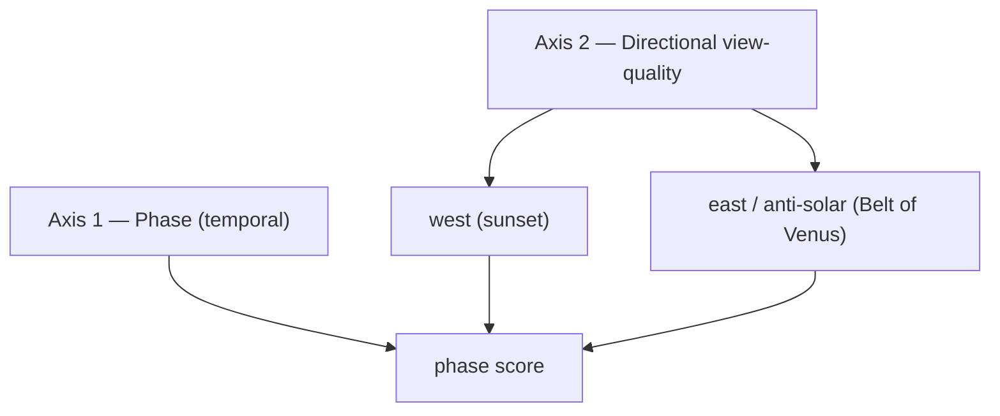

# Directional View-Quality Model (Belt of Venus + sunset)

How spot recommendations weigh **which horizon must be clear** and **whether the
view is worth composing** — not just "is there an open horizon."

## Why

The old `beltOfVenus` phase score used direction-agnostic signals (open-horizon
keyword + any elevation). It shared its whole ingredient list with generic "high
vantage," so the Belt-of-Venus recommendation was effectively a duplicate — and
it ignored the one thing that matters: a clear **eastern / anti-solar** horizon.
It also treated a flat empty horizon as ideal, when in practice the memorable
shots have the pink band over **distant relief, skyline, or water**.

## Model: two orthogonal axes



Each **phase** consumes the **direction** it needs: golden hour / sun disk → west;
Belt of Venus → east; blue hour / civil twilight stay omnidirectional.

## Directional view-quality profile (per direction)

Computed by a **range-aware horizon read** — `src/lib/locationDiscovery/terrain.ts`.
Samples elevation outward along the bearing (Open-Meteo Elevation API — free, no
key, same provider as the weather data) and splits the ray into bands:

| Field | Band | Meaning | Role |
|-------|------|---------|------|
| `clearance` | near (≤3 km) | is the sightline open enough to *see* the phenomenon? | **gate** (multiplier) |
| `backdrop`  | far (5–30 km) | distant relief/silhouette to compose against | differentiator |
| `relief`    | far | terrain ruggedness / landscape variety in view | differentiator |

The near/far split is the key idea: **the same mountain is an obstruction up
close and a backdrop far away.** Curvature + standard refraction are corrected so
distance is honest.

Combined in `ranking.ts::directionalViewScore`:
```
viewScore = 100 * clearance * (0.55 + 0.28*backdrop + 0.17*relief)
```
Clearance gates (blocked → ~0). An open-but-empty horizon scores ~55; a clear
horizon framed by distant relief approaches 100.

Plus `getVarietyScore` — diversity of co-occurring elements (water, elevation,
foreground, city lights, open horizon) blended with terrain relief.

## Reuse map (new vs re-wired)

| Concern | Status |
|---------|--------|
| Forward-geodesic sampling | added `geo.ts::destinationPoint` |
| Elevation source | **reused** Open-Meteo (already the weather provider); no new credential |
| Horizon geometry, profiles | new `terrain.ts` |
| Async enrichment slot | **reused** the existing `enrichCandidates*` pattern in `discovery.ts` |
| Element signals (water/elevation/foreground/city) | **reused** existing `has*Signal` helpers |
| Ranker stays pure/sync | terrain attached as `candidate.viewProfiles`; ranker only reads it |
| Graceful fallback | terrain failure → no profiles → keyword heuristics (unchanged behavior) |

## Applied to other dimensions

- **West / sunset phases (`sunDisk`, `goldenHour`)**: now use the same terrain
  west-profile in place of the crude `scoreWestwardView` keyword bonus. One
  routine, aimed both directions.
- **Atmospheric factors (`scoring.ts`: cloud, visibility, humidity, pressure,
  aerosol, wind, temp)**: **not applicable** — these are weather, not spatial;
  terrain/direction doesn't enter. Left unchanged.
- **`civilTwilight`, `blueHour`**: left omnidirectional (reflection / city-light
  driven) for now.

## Live results (Surrey/Vancouver, 2026-07-14)

| Spot | Belt | East clr/bkd/rlf | Note |
|------|-----:|------------------|------|
| Burnaby Mountain | 73 | 1.00 / 0.00 / 0.40 | open east + vantage → top |
| Belcarra Regional Park | 55 | **0.25** / 0.24 / 0.47 | east blocked by inlet peaks → down for belt, strong for sunset (west bkd 1.00) |
| Crescent Beach | 48 | 0.90 / **0.05** / 0.13 | open but flat/empty → mediocre belt |
| Serpentine Fen | 36 | 0.50 / 0.40 / 0.24 | partly blocked east |

## Open follow-ups
- **Per-coordinate elevation cache** — terrain is static; today it re-fetches per
  cold discovery (adds ~1–3 s / a few Open-Meteo calls; discovery result is cached
  15 min). A keyed elevation cache would remove the cold-path latency.
- **Weighting** — the `0.55/0.28/0.17` composition and per-phase blends are first-pass;
  tune against real spot photos.
- **Belt UI chip** — the "Best for Belt of Venus" chip still duplicates the phase
  facet's filter; consolidate (it now has a real signal to rank by, so it could
  become a true ranker rather than a redundant toggle).
