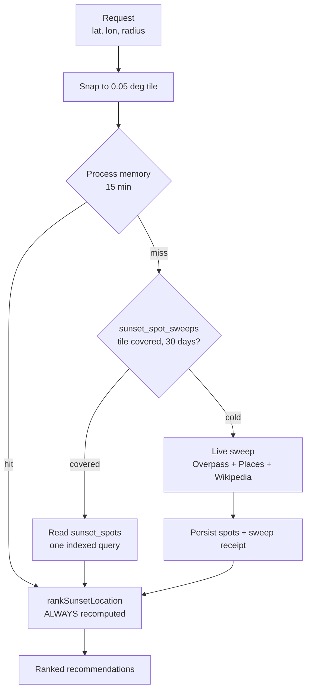
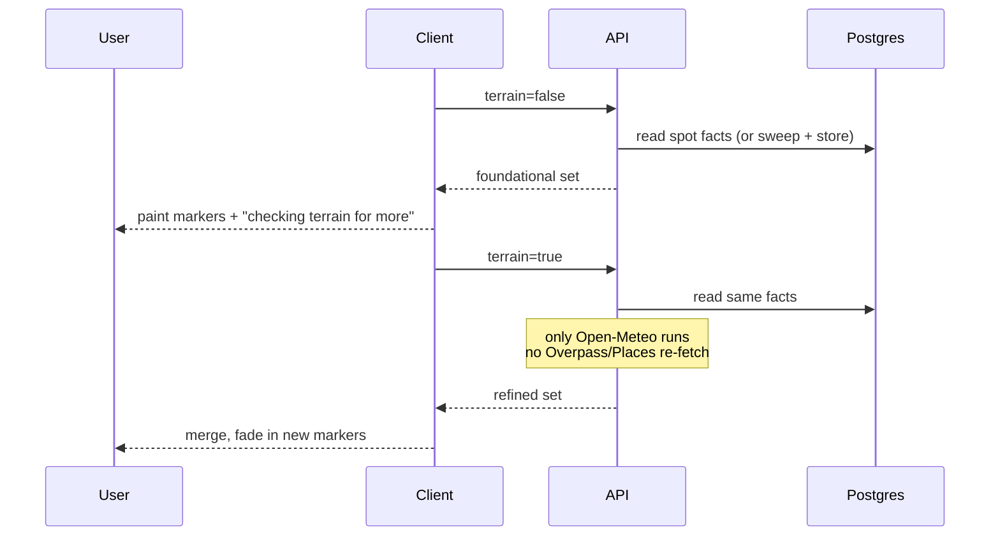

# Sunset Recommendation Metrics and Cache Strategy

## Core Metrics

Each recommended spot should be evaluated as a multivariate proposal, not a single point on the map. The current POC now exposes these metrics per candidate:

| Metric | Meaning | Why It Matters |
| --- | --- | --- |
| Phase fit | How well the spot works across golden hour, reflections, foreground, and vantage signals | Helps choose spots for the current lighting window |
| View quality | Combined estimate of open horizon, elevation, water, and visual usefulness | Main signal for whether a place is worth visiting |
| Direction fit | Whether the place likely faces the sunset or has panoramic/water exposure | Important for golden hour and sun disk shots |
| Sky color potential | Scenic/atmospheric suitability inferred from place type and tags | Helps rank beaches, viewpoints, water, and parks |
| Foreground interest | Whether the spot offers bridges, skyline, trees, boats, water, mountains, or landmarks | Better photos need subjects, not just sky |
| Reflection potential | Whether water is likely available for sunset or blue-hour reflection shots | Strong for beaches, lakes, rivers, marinas, piers |
| Access confidence | Public access signal | Avoid recommending places that may be private or impractical |
| Source confidence | Whether a spot has known/local reference support | Helps separate known spots from scout-worthy suggestions |

These metrics are returned in `recommendationMetrics` and can later feed phase-specific recommendations.

## Queryable Tags

Each candidate also returns `searchTags`, which are meant to be user-facing filters. Examples:

- Beach
- Park
- Water Reflection
- Wide Horizon
- High Vantage
- Western Exposure
- Foreground Interest
- Seasonal Scout

The UI uses these tags as filter pills so users can quickly isolate the type of sunset experience they want.

## Cache Strategy

The cache is split by **volatility**, not by storage medium. Recommendations are
never stored — only the facts they are computed from.

### What is stored vs. recomputed

| Layer | Content | Cost to produce | Changes every | Stored |
| --- | --- | --- | --- | --- |
| Spot facts | OSM tags, Places popularity, Wikipedia images | 3 external APIs | Months | Yes — `sunset_spots` |
| Horizon profiles | Open-Meteo elevation along the sunset azimuth | 1 external API | Season | Yes — with a `profile_azimuth_deg` stamp |
| Scores, phase fit, golden hour | `rankSunsetLocation` | Local CPU | **Day** | **No — always recomputed** |

Scoring is deliberately excluded. `rankSunsetLocation` reads `new Date()` for
golden-hour times and the sunset azimuth, so a stored score would be wrong the
next morning. Recomputing costs nothing and removes a whole class of staleness.

### Invalidation

Three independent triggers, each at the right granularity:

- **Criteria/shape change** — bump `SPOT_DATA_VERSION` in `spotStore.ts`. Older
  rows and sweeps stop matching, so the next request re-sweeps. Scoring changes
  need no bump at all; scores are never stored.
- **Facts age out** — a sweep older than 30 days no longer counts as coverage.
- **The sun moves** — a stored horizon profile sampled more than 4 degrees off
  today's sunset azimuth is re-sampled for those spots only, and written back.

### Why sweeps are recorded separately

`sunset_spot_sweeps` is what distinguishes *"this tile has no sunset spots"*
from *"this tile was never queried"*. Without it, empty areas (ocean, farmland)
would re-hit Overpass on every single request forever.

### Tiles, not coordinates

Requests snap to a 0.05 degree (~5.5 km) grid and sweeps run from the tile
centroid with the radius inflated by half a tile diagonal, so any request inside
the tile is fully covered. The previous key rounded to 3 decimals (~110 m),
which meant panning a map produced a fresh key — and a fresh set of external
calls — on nearly every move.

### Client cache

`localStorage`, keyed on a 250 m cell, TTL 15 minutes. Deliberately finer than
the server tile: it only dedupes near-identical centres so a coverage-triggered
re-fetch still gets through.

## Progressive Disclosure

The two-phase client load maps onto the two stored layers, so "load more" is
one real API call rather than a second full sweep.

- **Foundational** — ranked on durable place facts alone. Stable, and instant on
  a covered tile.
- **Refined** — terrain-backed scores. Merged into the foundational set, never
  swapped for it, so markers already on screen do not unmount or reorder.
- New arrivals get `.nf-spot-enter` (420 ms fade + rise, disabled under
  `prefers-reduced-motion`); the flag clears after the animation so filter and
  selection re-renders do not replay it.

## Cost Balance

Current request pattern per uncached area:

- Overpass high-confidence pass: 1 request.
- Overpass broad-scenic pass: 0-1 request, depending on whether enough results were found.
- Wikipedia image enrichment: only for candidates with Wikipedia-backed references.
- SunCalc: local CPU only, no API cost.
- Local fallback seeds: no API cost.

Practical cost posture:

- Most map movements should hit client cache.
- Repeated nearby users should hit server/database cache.
- External calls should happen only on first request per rounded area per 15 minutes.
- Google Places photos should stay out of the default path until there is a budget or paid tier.

## Recommended Next Step

Add phase-specific scores on top of these same metrics:

- Golden hour
- Sun disk
- Belt of Venus
- Civil twilight
- Blue hour

The current metrics are intentionally reusable for those phase scores.

